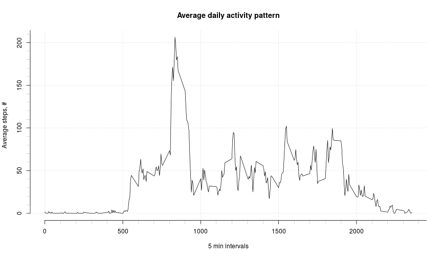

Here is some analysis of steps daily activity of 'Activity monitoring data' dataset.

This work is done in order to fulfill Peer Assessment 1 of Reproducible Research Coursera's course.


## Loading and preprocessing the data


Load the csv data from zip file to data.table.

```r
library(data.table)

file    <- unz(description='activity.zip', filename='activity.csv')
rawdata <- read.csv(file=file)

rm(file)
```

Get rid of **NA** values; precalc step means over all days for each interval; precalc steps over each day.

```r
tidydata <- data.table(rawdata[!is.na(rawdata$steps),])
tidydata.meansteps   <- tidydata[,list(mean=mean(steps)),by=interval]$mean
tidydata.stepsbydays <- tidydata[,list(sum=sum(steps)),by=date]$sum
```


## What is mean total number of steps taken per day?


TASK: *Make a histogram of the total number of steps taken each day.*

```r
hist(tidydata.stepsbydays,
     breaks=20,
     axes=FALSE,
     xlab='Steps, #',
     ylab='Frequency, %',
     main='Total steps per day')
axis(side=1, 1000*rep(0:22), labels=FALSE, lwd=0.2)
axis(side=1, 5000*rep(0:5))
axis(side=2, 1:10, labels=FALSE, lwd=0.2)
axis(side=2, 2*0:5)
```

 

TASK: *Calculate and report the __mean__ and __median__ total number of steps taken per day.*

```r
median(tidydata.stepsbydays)
```

```
## [1] 10765
```

```r
mean(tidydata.stepsbydays)
```

```
## [1] 10766.19
```


## What is the average daily activity pattern?


TASK: *Make a time series plot (i.e. type = "l") of the 5-minute interval (x-axis) and the average number of steps taken, averaged across all days (y-axis).*

```r
plot(unique(tidydata$interval),
     tidydata.meansteps,
     type="l",
     axes=FALSE,
     xlab="5 min interval",
     ylab="Average steps, #",
     main="Average daily activity pattern")
axis(side=1, 100*0:24, labels=FALSE, lwd=0.2)
axis(side=1, 500*0:5)
axis(side=2, 10*1:21, labels=FALSE, lwd=0.2)
axis(side=2, 50*0:5)
```

 

TASK: *Which 5-minute interval, on average across all the days in the dataset, contains the maximum number of steps?.*

```r
tidydata[which.max(tidydata.meansteps)]$interval
```

```
## [1] 835
```


## Imputing missing values


TASK: *Calculate and report the total number of missing values in the dataset (i.e. the total number of rows with NAs).*

```r
mistat <- table(is.na(rawdata$steps))
names(mistat) <- c("has values", "missed values")
c(mistat[2],mistat[1])
```

```
## missed values    has values 
##          2304         15264
```

TASK: *Create a new dataset that is equal to the original dataset but with the missing data filled in.*

All mised values will be filled with mean values.

```r
cdata <- data.frame(tidydata[,list(mean=mean(steps)),by=interval])
cdata <- merge(cdata,rawdata[is.na(rawdata$steps),],)
cdata$steps <- cdata$mean
cdata <- cdata[c("steps","date","interval")]
cdata <- rbind(tidydata,cdata)
```

TASK: *Make a histogram of the total number of steps taken each day.*

```r
hist(cdata[,list(sum=sum(steps)),by=date]$sum,
     breaks=20,
     axes=FALSE,
     xlab='Steps, #',
     ylab='Frequency, %',
     main="Total steps per day, NA's corrected")
axis(side=1, 1000*rep(0:22), labels=FALSE, lwd=0.2)
axis(side=1, 5000*rep(0:5))
axis(side=2, 1:20, labels=FALSE, lwd=0.2)
axis(side=2, 2*0:10)
```

 

TASK: *Calculate and report the mean and median total number of steps taken per day.*

```r
cdata.stepsbydays <- cdata[,list(sum=sum(steps)),by=date]$sum
median(cdata.stepsbydays)
```

```
## [1] 10766.19
```

```r
mean(cdata.stepsbydays)
```

```
## [1] 10766.19
```

TASK: *Do these values differ from the estimates from the first part of the assignment?*

```r
median(cdata.stepsbydays) - median(tidydata.stepsbydays)
```

```
## [1] 1.188679
```

```r
mean(cdata.stepsbydays) - mean(tidydata.stepsbydays)
```

```
## [1] 0
```

TASK: *What is the impact of imputing missing data on the estimates of the total daily number of steps?*

Imputing missing values based on median of existing values leads to increasing frequency of average value in dataset.

Mean and median are identical now.


## Are there differences in activity patterns between weekdays and weekends?


TASK: *Create a new factor variable in the dataset with two levels – “weekday” and “weekend” indicating whether a given date is a weekday or weekend day.*

```r
cdata.f <- weekdays(strptime(cdata$date,"%Y-%m-%d"))
library(plyr)
cdata.f <- as.factor(revalue(cdata.f, c("Sunday"="weekend",
                                        "Monday"="weekday",
                                        "Tuesday"="weekday",
                                        "Wednesday"="weekday",
                                        "Thursday"="weekday",
                                        "Friday"="weekday",
                                        "Saturday"="weekend")))
```

TASK: *Make a panel plot containing a time series plot (i.e. type = "l") of the 5-minute interval (x-axis) and the average number of steps taken, averaged across all weekday days or weekend days (y-axis).*

```r
library(lattice)
wdata <- cdata[,list(mean=mean(steps)),by=list(cdata.f,interval)]
xyplot(wdata$mean ~ wdata$interval | wdata$cdata.f,
       layout = c(1, 2),
       breaks=20,
       axes=FALSE,
       type="l",
       xlab="5 min interval",
       ylab="Average steps, #",
       main="Weekday activity difference")
```

 


## R Session Information


```r
sessionInfo()
```

```
## R version 3.1.1 (2014-07-10)
## Platform: x86_64-pc-linux-gnu (64-bit)
## 
## locale:
##  [1] LC_CTYPE=en_US.UTF-8       LC_NUMERIC=C              
##  [3] LC_TIME=en_US.UTF-8        LC_COLLATE=en_US.UTF-8    
##  [5] LC_MONETARY=en_US.UTF-8    LC_MESSAGES=en_US.UTF-8   
##  [7] LC_PAPER=en_US.UTF-8       LC_NAME=C                 
##  [9] LC_ADDRESS=C               LC_TELEPHONE=C            
## [11] LC_MEASUREMENT=en_US.UTF-8 LC_IDENTIFICATION=C       
## 
## attached base packages:
## [1] stats     graphics  grDevices utils     datasets  methods   base     
## 
## other attached packages:
## [1] lattice_0.20-29  plyr_1.8.1       data.table_1.9.4 knitr_1.7       
## 
## loaded via a namespace (and not attached):
## [1] chron_2.3-45   evaluate_0.5.5 formatR_1.0    grid_3.1.1    
## [5] Rcpp_0.11.3    reshape2_1.4   stringr_0.6.2  tools_3.1.1
```
